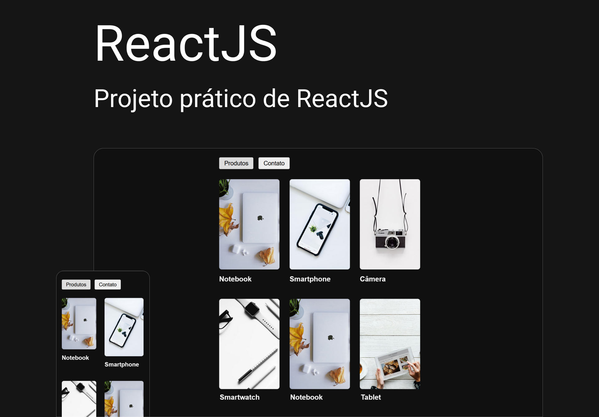

# Origamid - ReactJS



<div>
  
  
  
  
<div>
<br /> <br />

# React: +18hrs

<p>
  React do zero para o desenvolvimento de aplicações web reativas. <br />
  Foco é no entendimento completo do React, com isso praticamente tudo será criado do zero, sem a dependência de pacotes externos. <br />

- **Fundamentos do React + Vite:** .<br />
- **Vite, Components, props, children, hooks:** .<br />
- **CSS / styled-components:** .<br />
- **React Router DOM:** .<br />
- **Consumindo API:** .<br />
- **Intro a estrutura de pastas:** .<br />
- **React Router DOM:** .<br />
</p>
<br /> <br />

# 📚 Aprendizados

Criar animações suaves e intercaladas com cards (Motion Design). <br />
Organizar as informações e elementos visuais de forma simples, intuitiva e agradável, baseando em estudos, mantendo a consistência de estilos.
<br /><br />

# 🚀 Deploy

[Ver online](https://diogorealles.github.io/)

## Clone

```
git clone git@github.com:DiogoRealles/git
```

<p>Gostou? deixa seu like!</p>
<p>Estou disponível para realizar seus projetos</p>

<!--
<a href="mailto:diogorealles@hotmail.com"></a>
-->

<a href="https://www.linkedin.com/in/diogorealles/"></a>

<p><strong>

[Diogo Realles](https://diogorealles.github.io/) | 2025
</strong></p>
